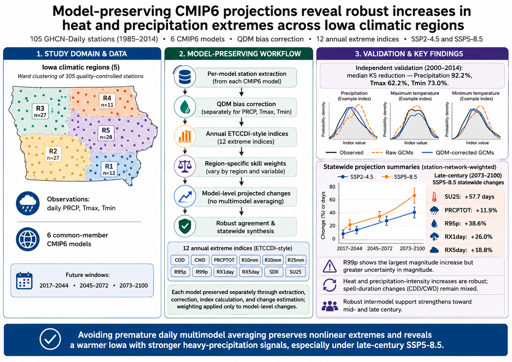
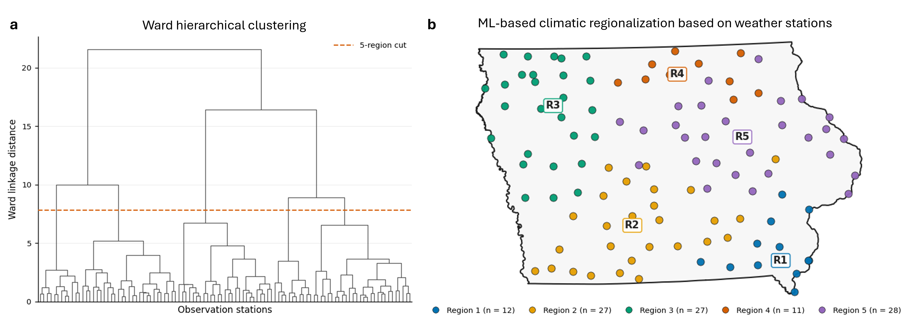
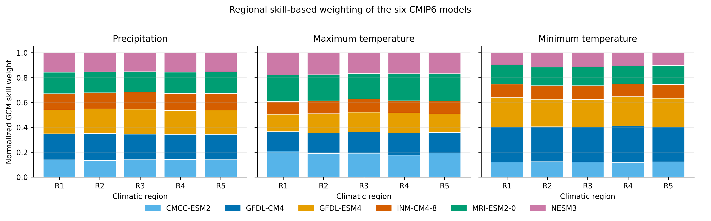
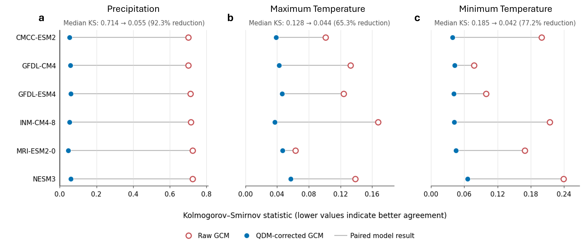
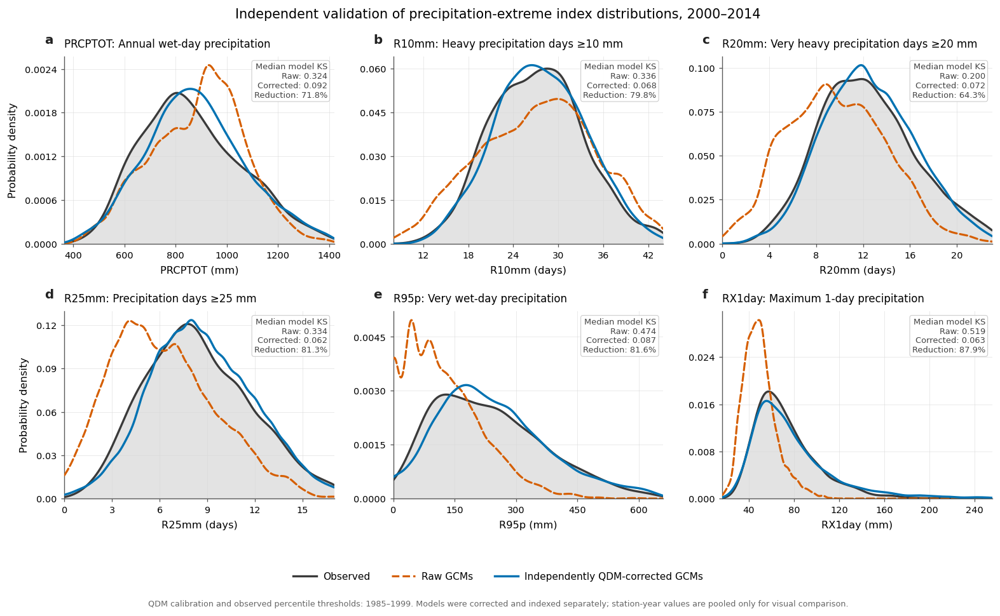
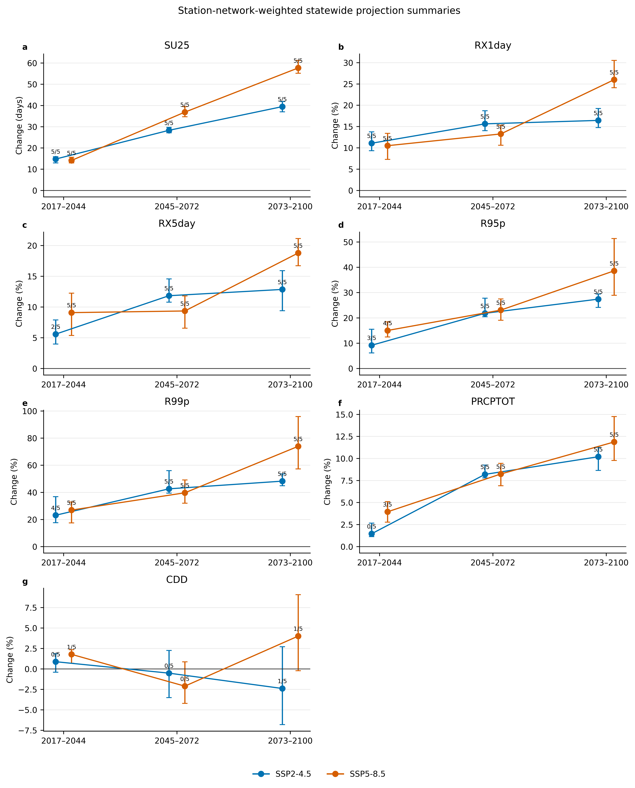
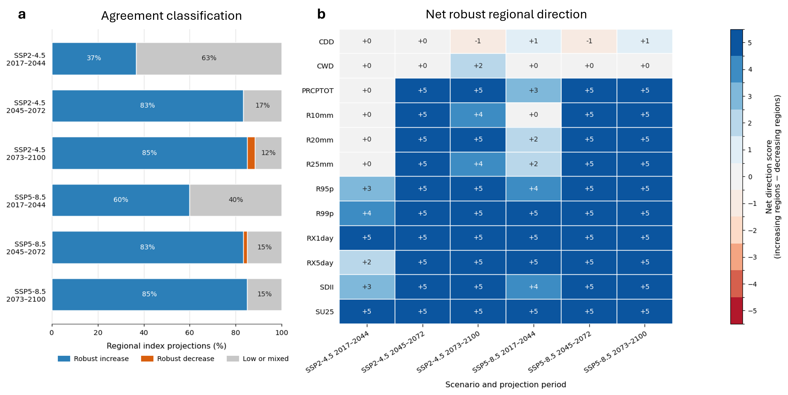
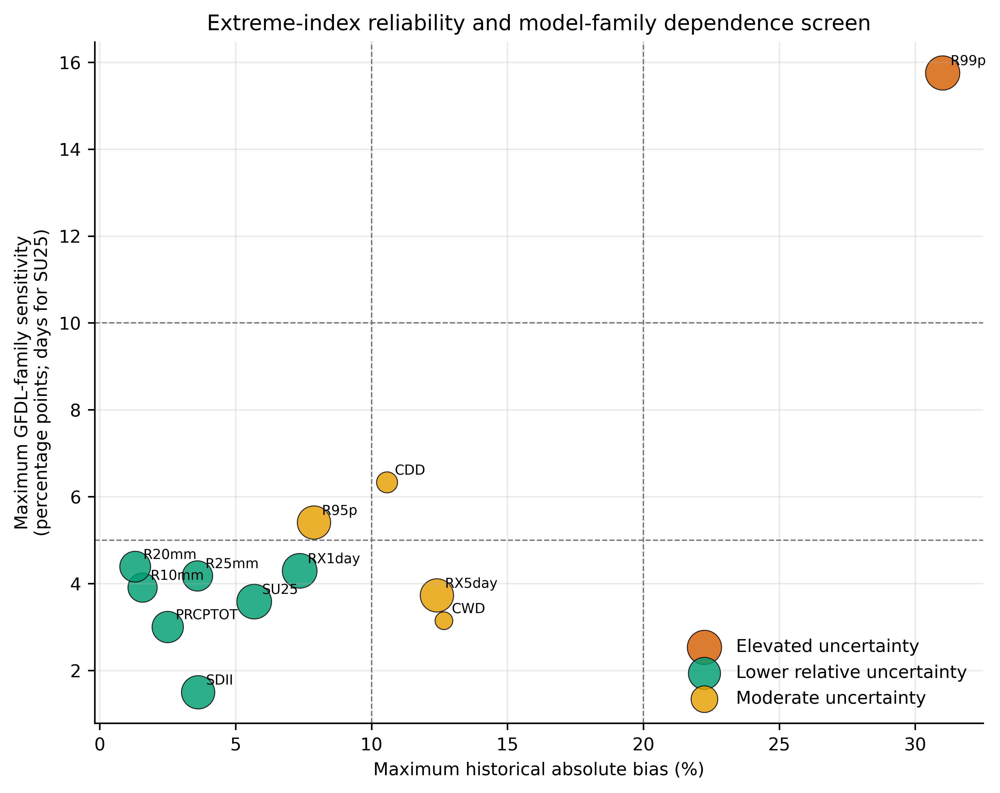
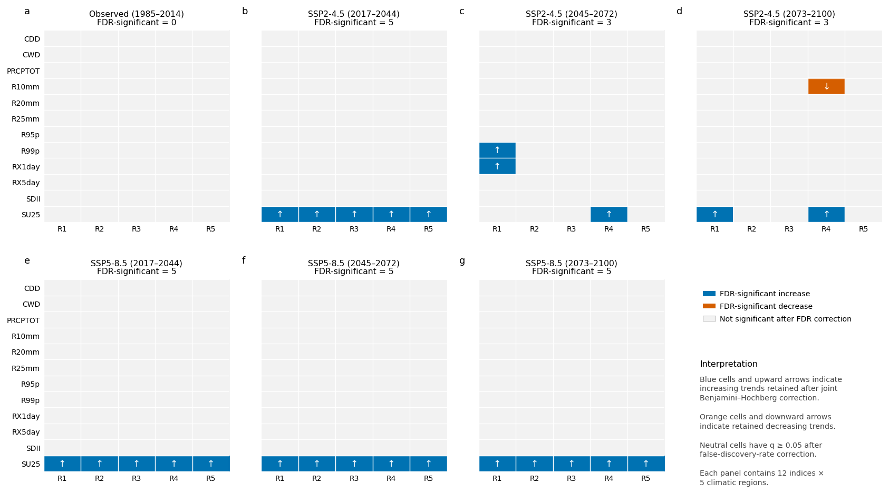

<div align="center">

# Iowa Climate Futures Explorer

### Model-preserving CMIP6 projections of heat and precipitation extremes across Iowa climatic regions

[](#project-status)
[](#cmip6-ensemble)
[](#study-design)
[](./LICENSE)

**A reproducible regional climate-extremes assessment that preserves each CMIP6 model through bias correction, index calculation, and change estimation before skill-weighted synthesis.**

<br>



</div>

---

## Overview

The **Iowa Climate Futures Explorer** repository contains the validated analytical outputs and publication figures from a CMIP6 assessment of heat and precipitation extremes across Iowa.

The analysis addresses a common methodological problem in multimodel climate studies: daily outputs from free-running global climate models are not synchronized weather realizations. Averaging them before bias correction or extreme-index calculation can suppress peaks, create artificial sequences, and distort threshold, rolling-accumulation, and spell-duration metrics.

This study therefore follows a **model-preserving workflow**:

> Each GCM is extracted, bias-corrected, indexed, and evaluated independently. Regional skill weights are applied only to model-level projected changes.

---

## Project status

| Component | Status |
|---|---|
| Station quality control and climatic regionalization | Complete |
| CMIP6 common-member audit and extraction | Complete |
| Independent QDM validation | Complete |
| Twelve annual extreme-index calculations | Complete |
| Regional skill weighting and model-level projections | Complete |
| Agreement, residual-bias, family-sensitivity, and FDR analyses | Complete |
| Publication figures and derived outputs | Complete |
| Interactive dashboard | Planned |

The current repository documents the completed scientific analysis. A Streamlit dashboard is planned as a separate interface for exploring the final derived tables; it will not recompute the complete daily climate-processing pipeline during user interaction.

---

## Study design

| Element | Specification |
|---|---|
| Study area | Iowa, USA |
| Observations | 105 quality-controlled NOAA GHCN-Daily stations |
| Observation period | 1985–2014 |
| Climatic regionalization | Five Ward-cluster regions |
| CMIP6 ensemble | Six GCMs, common `r1i1p1f1` member |
| Variables | Daily precipitation, maximum temperature, minimum temperature |
| Scenarios | SSP2-4.5 and SSP5-8.5 |
| Bias correction | Station- and month-specific quantile-delta mapping |
| Independent calibration | 1985–1999 |
| Independent validation | 2000–2014 |
| Projection baseline | 1987–2014 |
| Future windows | 2017–2044, 2045–2072, 2073–2100 |
| Extreme indices | 12 annual ETCCDI-style indices |
| Statewide aggregation | Station-network-weighted, not area-weighted |

---

## Climatic regionalization

<p align="center">
  
</p>

The 105 retained stations were grouped using standardized geographic and climatological attributes:

- latitude and longitude;
- elevation;
- mean annual precipitation;
- mean annual maximum temperature; and
- mean annual minimum temperature.

| Region | Stations | Fraction of station network |
|---:|---:|---:|
| R1 | 12 | 0.114 |
| R2 | 27 | 0.257 |
| R3 | 27 | 0.257 |
| R4 | 11 | 0.105 |
| R5 | 28 | 0.267 |

These fractions are used only for station-network-weighted statewide summaries. They are not area, population, watershed, cropland, or exposure weights.

---

## CMIP6 ensemble

Six models were retained after auditing the historical, SSP2-4.5, and SSP5-8.5 experiments for complete precipitation, maximum-temperature, and minimum-temperature chains.

| Model | Member |
|---|---|
| CMCC-ESM2 | `r1i1p1f1` |
| GFDL-CM4 | `r1i1p1f1` |
| GFDL-ESM4 | `r1i1p1f1` |
| INM-CM4-8 | `r1i1p1f1` |
| MRI-ESM2-0 | `r1i1p1f1` |
| NESM3 | `r1i1p1f1` |

Regional skill weights vary by climatic region and variable; no single GCM dominates across all combinations.

<p align="center">
  
</p>

---

## Model-preserving analytical workflow

1. Screen GHCN-Daily stations for quality and completeness.
2. Delineate five climatic regions using Ward hierarchical clustering.
3. Audit CMIP6 models for a complete common-member chain.
4. Extract daily model values at station locations.
5. Evaluate historical skill in five contiguous temporal blocks.
6. Apply QDM independently by model, station, month, and variable.
7. Calculate annual extreme indices separately for every model.
8. Estimate future change relative to each model's own baseline.
9. Apply region- and variable-specific weights to model-level changes.
10. Classify robust directional agreement among the six models.
11. Evaluate residual historical bias and GFDL-family sensitivity.
12. Test Mann–Kendall trends with Benjamini–Hochberg FDR control.
13. Aggregate regional results using the station-network fractions.

### Annual indices

| Index | Definition | Reported change |
|---|---|---|
| CDD | Maximum consecutive dry days | % |
| CWD | Maximum consecutive wet days | % |
| PRCPTOT | Annual precipitation on wet days | % |
| R10mm | Days with precipitation ≥10 mm | % |
| R20mm | Days with precipitation ≥20 mm | % |
| R25mm | Days with precipitation ≥25 mm | % |
| R95p | Precipitation above the observed 95th wet-day percentile | % |
| R99p | Precipitation above the observed 99th wet-day percentile | % |
| RX1day | Annual maximum one-day precipitation | % |
| RX5day | Annual maximum consecutive five-day precipitation | % |
| SDII | Mean wet-day precipitation intensity | % |
| SU25 | Days with maximum temperature >25 °C | days |

A wet day is defined as precipitation ≥1 mm.

---

## Independent bias-correction validation

QDM was calibrated on **1985–1999** and evaluated on the withheld **2000–2014** period.

| Variable | Median raw KS | Median corrected KS | Median reduction |
|---|---:|---:|---:|
| Precipitation | 0.714 | 0.055 | 92.2% |
| Maximum temperature | 0.128 | 0.044 | 62.2% |
| Minimum temperature | 0.185 | 0.042 | 73.0% |

<p align="center">
  
</p>

<p align="center">
  
</p>

The projection configuration was subsequently refitted on the full 1985–2014 historical period before application to the future simulations.

---

## Key findings

### 1. Heat is the clearest and most spatially consistent signal

Under late-century SSP5-8.5, the station-network-weighted increase in summer days is:

> **SU25: +57.7 days per year**

All five climatic regions show robust increases across every scenario-period combination.

### 2. Heavy precipitation intensifies faster than annual precipitation

Late-century SSP5-8.5 statewide changes are:

| Index | Projected change |
|---|---:|
| PRCPTOT | +11.9% |
| R95p | +38.6% |
| RX1day | +26.0% |
| RX5day | +18.8% |

The much larger increases in upper-tail and short-duration precipitation than in annual totals indicate intensification of heavy precipitation rather than uniform scaling of all wet days.

<p align="center">
  
</p>

### 3. Robust agreement strengthens through the century

| Scenario | 2017–2044 | 2045–2072 | 2073–2100 |
|---|---:|---:|---:|
| SSP2-4.5 | 22 of 60 robust increases | 50 of 60 | 51 of 60 |
| SSP5-8.5 | 36 of 60 robust increases | 50 of 60 | 51 of 60 |

A projection is classified as robust when:

- at least five of six models agree on the sign; and
- the weighted magnitude exceeds 1% for percentage-change indices or 1 day for SU25.

<p align="center">
  
</p>

### 4. Spell-duration changes remain mixed

CDD and CWD do not show the same spatial and directional consistency as heat and precipitation-intensity indices. A wetter climate does not necessarily imply longer continuous wet spells because annual totals, event intensity, and wet/dry-day sequencing measure different processes.

### 5. The rarest precipitation tail has the greatest magnitude uncertainty

R99p remains positive in direction but has elevated residual bias and related-model sensitivity:

| Diagnostic | R99p |
|---|---:|
| Median residual absolute bias | 22.60% |
| Maximum residual absolute bias | 31.01% |
| Median GFDL-family sensitivity | 5.15 percentage points |
| Maximum GFDL-family sensitivity | 15.76 percentage points |

R99p should therefore be interpreted as an uncertainty-qualified rare-tail indicator rather than as a precise engineering design value.

---

## Regional model-level projections

<p align="center">
  
</p>

The boxes summarize the six independently processed GCMs. They preserve model spread and regional heterogeneity rather than presenting a synthetic daily multimodel time series.

---

## Reliability and trend diagnostics

### Residual bias and model-family sensitivity

<p align="center">
  
</p>

The reliability classes combine residual historical bias with sensitivity to alternative treatment of GFDL-CM4 and GFDL-ESM4. They are descriptive diagnostics, not probabilities.

### FDR-controlled trend evidence

Across 420 Mann–Kendall tests:

- 54 had nominal `p < 0.05`;
- 26 remained significant after joint Benjamini–Hochberg correction;
- 23 of the retained trends were SU25 increases; and
- the remaining three were individual future increases in R10mm, R99p, and RX1day.

Period changes and within-period monotonic trends are distinct forms of evidence and should not be interpreted interchangeably.

<p align="center">
  
</p>

---

## Community and planning relevance

The results provide regional, uncertainty-qualified evidence for Iowa climate-risk screening.

| Application | Relevant evidence |
|---|---|
| Stormwater and drainage planning | Robust RX1day and RX5day increases |
| Flood preparedness | Increasing short-duration and multi-day rainfall intensity |
| Agriculture | More hot days, ponding risk, erosion potential, and operational disruption |
| Livestock and occupational heat planning | Large and spatially consistent SU25 increases |
| Nutrient and soil management | More intense precipitation and runoff-generating conditions |
| Regional planning | Five climatic regions reveal heterogeneity masked by statewide means |

These projections support regional comparison and adaptation screening. They do not replace site-specific hydrologic, hydraulic, agricultural, health, or engineering analysis.

---

## Figure inventory

All current publication and supplementary figures are stored in:

[`12_FINAL_PAPER_FIGURES/`](./12_FINAL_PAPER_FIGURES/)

| File | Content |
|---|---|
| `Gabstract.png` | Graphical abstract |
| `Fig01_Iowa_climatic_regionalization.png` | Dendrogram and five-region station map |
| `Fig02_Regional_GCM_skill_weights.png` | Regional and variable-specific model weights |
| `Fig03_Independent_per_GCM_QDM_validation.png` | Independent daily-distribution validation |
| `Fig04_Independent_extreme_index_distribution_validation.png` | Independent annual-index validation |
| `Fig05_Historical_extreme_index_validation.png` | Historical residual-bias diagnostic |
| `Fig06_Regional_model_level_projected_changes.png` | Model-level regional projections |
| `Fig07_Robust_model_agreement_summary.png` | Agreement classification and net direction |
| `Fig08_Key_statewide_projection_summaries.png` | Statewide station-network-weighted summaries |
| `Fig09_Index_reliability_and_family_sensitivity.png` | Reliability and family-sensitivity screen |
| `Fig10_FDR_corrected_trend_matrices.png` | FDR-controlled trend results |
| `FigS01_Station_completeness.png` | Station completeness diagnostic |
| `FigS02_Statewide_aggregation_sensitivity.png` | Statewide aggregation sensitivity |

> `Fig6New.png` appears to be an obsolete or duplicate working figure and should be removed after confirming that it is not referenced by the manuscript, code, or release package.

---

## Data sources

| Purpose | Source |
|---|---|
| Daily station precipitation and temperature | NOAA Global Historical Climatology Network-Daily |
| CMIP6 daily model output | ESGF/Pangeo CMIP6 cloud catalogue |
| Iowa boundary | U.S. Census Bureau geographic data |
| Station coordinates and elevation | NOAA station metadata |

Source datasets retain their original licences, attribution requirements, and terms of use.

---

## Scientific limitations

- The ensemble contains six GCMs and one member per model.
- GFDL-CM4 and GFDL-ESM4 share institutional lineage.
- Nearest-grid-cell extraction does not resolve all local land-surface, urban, convective, and drainage processes.
- QDM corrects marginal distributions but does not guarantee correction of storm structure, spatial coherence, temporal dependence, or cross-variable dependence.
- Near-term projections remain influenced by internal variability.
- R99p has greater residual bias and family sensitivity than more frequently sampled heavy-precipitation indices.
- Statewide values are station-network-weighted and are not area-weighted Iowa means.

---

## Repository organization

A clean release structure is recommended:

```text
Iowa-Climate-Futures-Explorer/
├── README.md
├── LICENSE
├── CITATION.cff
├── notebooks/
├── src/
├── data/
│   ├── metadata/
│   └── derived/
├── outputs/
│   ├── publication_tables/
│   ├── validation_and_trends/
│   └── figure_source_data/
├── 12_FINAL_PAPER_FIGURES/
├── manuscript/
├── environment/
└── docs/
```

Large raw CMIP6 archives and daily corrected files should not be committed to GitHub. Retrieval instructions, metadata, compact derived tables, and reproducible code should be provided instead.

---

## Citation

A formal article citation and repository DOI should be added after publication and archival release.

Suggested repository citation:

> Mukarram, M. M. T. (2026). *Iowa Climate Futures Explorer: Model-preserving CMIP6 projections of heat and precipitation extremes across Iowa climatic regions*. GitHub repository.

After creating a versioned release, archive the repository with Zenodo and update both this section and `CITATION.cff` with the DOI.

---

## Author

**Mirza Md Tasnim Mukarram**  
School of Earth, Environment, and Sustainability  
University of Iowa, Iowa City, Iowa, USA  
Email: [mtasnimmukarram@uiowa.edu](mailto:mtasnimmukarram@uiowa.edu)

---

## License

Original code in this repository is released under the **MIT License**, unless otherwise stated. NOAA, CMIP6, ESGF/Pangeo, and U.S. Census Bureau datasets retain their respective licences and citation requirements.

---

<div align="center">

### Iowa Climate Futures Explorer

**Regional climate projections · Model-preserving analysis · Extreme-index diagnostics · Reproducible science**

</div>
